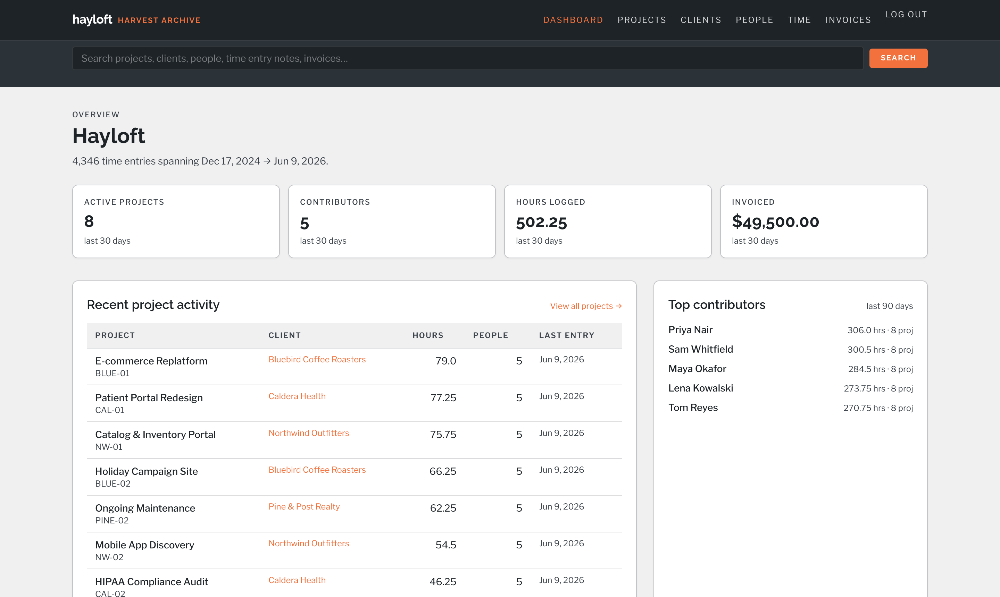
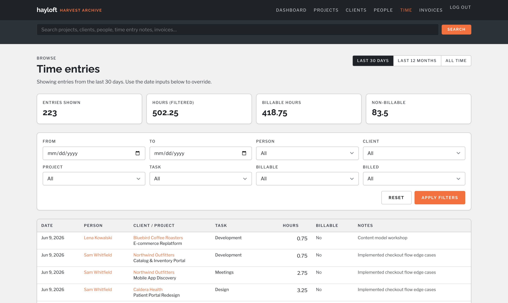
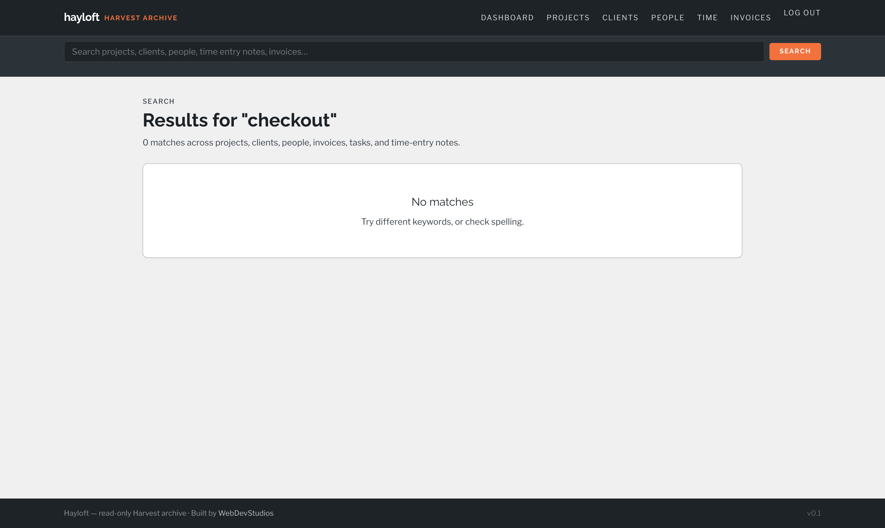

# Hayloft

**Keep your Harvest.** Hayloft is a self-hosted archive for your
[Harvest](https://www.getharvest.com) time-tracking history — every project,
client, person, time entry, invoice, and estimate, pulled into your own
Postgres database and served as a fast, searchable, read-only web app.

Leaving Harvest over pricing? Sunsetting an old account? Archive everything
first. Your team's decade of time data is worth keeping — and it should live
somewhere *you* control, in a format that will still open in twenty years.



## What it does

1. **Fetches** your entire Harvest account through the official API — 18+
   resource types including projects, tasks, clients, contacts, team members,
   time entries, invoices (with line items, payments, and messages),
   estimates, and expenses. Rate-limit aware, resumable, idempotent.
2. **Serves** the archive as a password-protected web app: dashboard, browse
   pages with period filters, cross-linked detail views, and full-text search
   across projects, people, invoices, and time-entry notes.
3. **Stays portable** — it's just Postgres. `pg_dump` produces a single
   `.sql` file restorable anywhere, forever. No vendor, no lock-in, no
   subscription.

| Time entries | Full-text search |
|---|---|
|  |  |

## Stack

- Node.js 22 / TypeScript
- [Hono](https://hono.dev) + JSX server-side rendering (no client framework)
- Postgres 17 with tsvector full-text search
- Tailwind CSS
- bcrypt-hashed shared password + signed-cookie sessions

## Quickstart (local)

```bash
# 1. Start local Postgres
docker compose up -d

# 2. Install deps and configure
npm install
cp .env.example .env
# edit .env: add your Harvest credentials (DATABASE_URL is preset for the docker postgres)

# 3. Generate a password hash + session secret
npm run hash-password -- "your-shared-team-password"
# paste output into .env

# 4. Apply schema
npm run migrate

# 5. Smoke-test the fetcher
npm run fetch -- --resource users

# 6. Pull everything
npm run fetch

# 7. Start the dev server
npm run dev
# → http://localhost:3000
```

No Harvest account handy? `npm run seed-demo` loads a small fake dataset so
you can explore the UI.

## Deploying

Hayloft runs anywhere Node and Postgres do. A complete walkthrough for
[Railway](https://railway.app) (managed Postgres, ~$5–10/mo) is in
[DEPLOY.md](./DEPLOY.md).

## Archiving for the very long term

```bash
pg_dump "$DATABASE_URL" --no-owner --no-acl | gzip > hayloft-$(date +%F).sql.gz
```

That file *is* your archive. Stick it in cold storage; restore it into any
Postgres with `psql` whenever you need it.

## Contributing

PRs welcome — see [CONTRIBUTING.md](./CONTRIBUTING.md).

## Credits

Built by [WebDevStudios](https://webdevstudios.com), released under the
[MIT license](./LICENSE).

Hayloft is an independent project and is not affiliated with or endorsed by
Harvest. It uses the official Harvest API with your own credentials.
